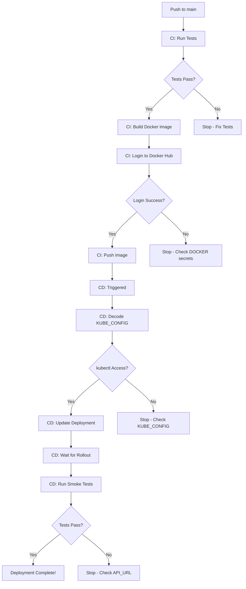

# GitHub Secrets Configuration Guide

## Required Secrets for CI/CD

Your CI/CD pipelines require these secrets to be configured in GitHub repository settings.

### How to Access Secrets Settings

1. Go to: https://github.com/devaprasadp-bits/MLOPS_Assignment2_Group126
2. Click **Settings** (top navigation)
3. In left sidebar: **Secrets and variables** → **Actions**
4. Click **New repository secret**

---

## For CI Pipeline (Docker Hub)

### 1. DOCKER_USERNAME
**Description:** Your Docker Hub username  
**How to get:** Your Docker Hub login username  
**Example:** `devaprasadp` or `johndoe`

```
Name: DOCKER_USERNAME
Value: your-dockerhub-username
```

### 2. DOCKER_PASSWORD
**Description:** Docker Hub Access Token (NOT your password)  
**How to get:**
1. Login to https://hub.docker.com
2. Click your username (top right) → **Account Settings**
3. Click **Security** → **New Access Token**
4. Name: "GitHub Actions CI"
5. Permissions: Read, Write, Delete
6. Copy the token (shown only once!)

```
Name: DOCKER_PASSWORD
Value: dckr_pat_xxxxxxxxxxxxxxxxxxxxxxxxxxxxx
```

**Important:** Use Access Token, not your actual password!

---

## For CD Pipeline (Kubernetes)

### 3. KUBE_CONFIG
**Description:** Base64-encoded Kubernetes config file  
**How to get:**

#### If using Minikube:
```bash
# Method 1: Direct encoding
cat ~/.kube/config | base64 | tr -d '\n'

# Method 2: Save to file first
base64 ~/.kube/config | tr -d '\n' > kube_config_base64.txt
cat kube_config_base64.txt
```

#### If using cloud K8s (AWS EKS, GCP GKE, Azure AKS):
```bash
# Get your cluster kubeconfig
aws eks update-kubeconfig --name your-cluster --region us-west-2
# OR
gcloud container clusters get-credentials your-cluster --region us-central1
# OR
az aks get-credentials --resource-group myResourceGroup --name myAKSCluster

# Encode it
cat ~/.kube/config | base64 | tr -d '\n'
```

```
Name: KUBE_CONFIG
Value: [very long base64 string]
```

### 4. API_URL
**Description:** The deployed API URL for smoke tests  
**How to get:**

#### If using Minikube:
```bash
# After deploying to Minikube
minikube service cats-dogs-service --url -n mlops
# Example output: http://192.168.49.2:30080
```

#### If using LoadBalancer in cloud:
```bash
kubectl get svc cats-dogs-service -n mlops
# Use the EXTERNAL-IP shown
# Example: http://35.123.456.789
```

```
Name: API_URL
Value: http://your-api-url:port
```

**Note:** This needs to be accessible from GitHub Actions runners (public IP or use ngrok/similar for local testing).

---

## Secrets Summary Checklist

Before pushing to GitHub `main` branch, ensure you have:

- [<br>] DOCKER_USERNAME - Your Docker Hub username
- [ ] DOCKER_PASSWORD - Docker Hub access token
- [ ] KUBE_CONFIG - Base64-encoded kubeconfig
- [ ] API_URL - Deployed API endpoint URL

---

## Testing Secrets Locally (Optional)

Before committing to GitHub, test that your secrets work:

### Test Docker Hub Login
```bash
echo "$DOCKER_PASSWORD" | docker login -u "$DOCKER_USERNAME" --password-stdin
# Should show: Login Succeeded
```

### Test Kubernetes Access
```bash
# Decode and test kubeconfig
echo "$KUBE_CONFIG" | base64 -d > /tmp/kubeconfig
kubectl --kubeconfig=/tmp/kubeconfig get nodes
rm /tmp/kubeconfig
```

### Test API URL
```bash
curl "$API_URL/health"
# Should return: {"status":"healthy","model_loaded":true,...}
```

---

## What Happens When Secrets Are Set

### On Push to `main` Branch



### Without Secrets

- **Without DOCKER_USERNAME/PASSWORD:** CI will skip the publish step (it won't push to Docker Hub)
- **Without KUBE_CONFIG:** CD will fail at kubectl configuration step
- **Without API_URL:** CD smoke tests will use default localhost (and likely fail)

---

## Security Best Practices

1. **Never commit secrets** to git repository
2. **Use access tokens**, not passwords
3. **Rotate tokens regularly** (every 90 days)
4. **Use minimal permissions** (read/write only what's needed)
5. **Delete old tokens** when not in use

---

## Alternative: Local Testing Without Secrets

If you want to test CI/CD flows locally without setting up GitHub secrets:

### Local CI Test
```bash
# Run tests
pytest tests/ -v --cov=src

# Build Docker (skip push)
docker build -t cats-dogs-classifier:latest .
```

### Local CD Test
```bash
# Deploy to local Minikube
minikube start
minikube image load cats-dogs-classifier:latest
kubectl apply -f deployment/kubernetes/deployment.yaml

# Run smoke tests
export API_URL=$(minikube service cats-dogs-service --url -n mlops)
python tests/smoke_test.py
```

This tests the same logic without GitHub Actions.

---

## Troubleshooting

### "Error: secrets.DOCKER_USERNAME not found"
**Fix:** Add DOCKER_USERNAME in repository secrets

### "Error: failed to parse kubeconfig"
**Fix:** Ensure KUBE_CONFIG is properly base64-encoded without line breaks

### "Smoke tests failed: Connection refused"
**Fix:** Check that API_URL is correct and accessible from internet

### "Permission denied to push to Docker Hub"
**Fix:** Check that DOCKER_PASSWORD is an access token with write permissions

---

## Contact

If you need help configuring secrets or troubleshooting CI/CD, refer to:
- **internal/TESTING_VALIDATION.md** - Complete CI/CD analysis
- **internal/QUICKSTART_REVIEWER.md** - Testing guide
- **README.md** - Full project documentation
